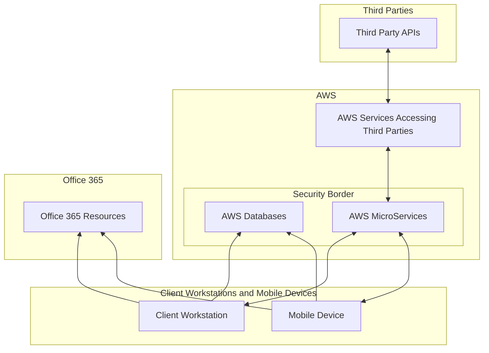

```mermaid
flowchart BT

    subgraph "AWS"
      subgraph "Security Border"
          AWSDatabases["AWS Databases"]
          AWSServices["AWS MicroServices"]
      end
      AWSThirdParties["AWS Services Accessing Third Parties"]    
    end
    subgraph "Third Parties"
      ThirdParties["Third Party APIs"]
    end 
    subgraph "Office 365"
        Office365["Office 365 Resources"]
    end
        subgraph "Client Workstations and Mobile Devices"
        ClientWS["Client Workstation"]
        MobileDevice["Mobile Device"]
    end


   

    ClientWS --> AWSDatabases
    MobileDevice --> AWSDatabases

    ClientWS <--> AWSServices
    MobileDevice <--> AWSServices

    AWSServices <--> AWSThirdParties
    AWSThirdParties <--> ThirdParties
 
  
    ClientWS --> Office365
    MobileDevice --> Office365

  ```
```
